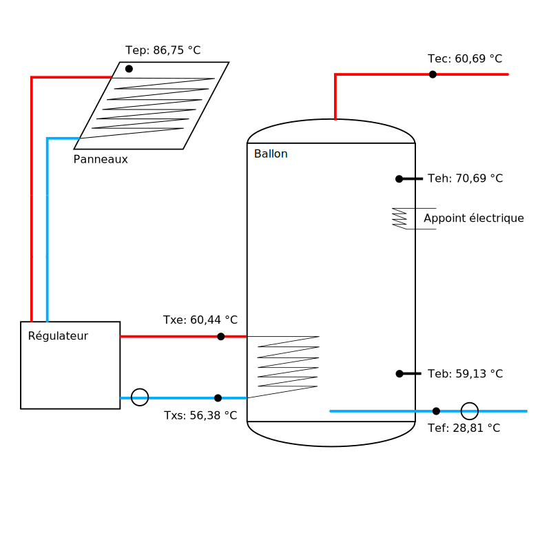
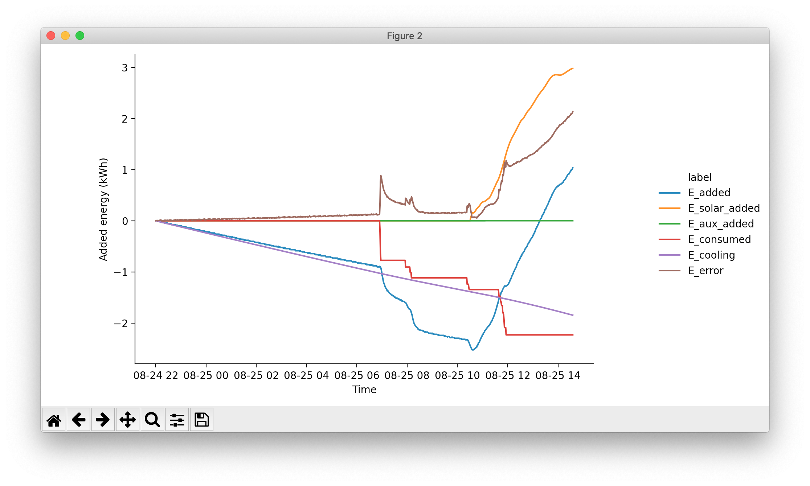

# Datalogging solaire thermique

Ce programme s’intègre dans le système de datalogging de bâtiments de la ville de Lorient. Zabbix est utilisé pour afficher les données et alerter en cas d’anomalie détectée sur les mesures.

L’objectif est ici de faire remonter vers ce système les données mesurées sur une installation de production d’eau chaude sanitaire solaire, avec un appoint électrique.

- [Affichage pour le monitoring de l’installation et l’exploitation des données](https://zabbix.empower-lorient.fr/zabbix.php?action=dashboard.view&dashboardid=12)
- [Affichage pour le debug](https://zabbix.empower-lorient.fr/zabbix.php?action=dashboard.view&dashboardid=10)



## Architecture

Un Arduino lit les données des capteurs et les envoie sur l’interface série (par USB), sans traitement.

- [Montage et installation l’Arduino](./arduino/README.md)
- [Code Arduino](./arduino/data_acquisition/data_acquisition.ino)

Un Raspberry Pi récupère et traite ces données avec un script Python :

- [serial_reader.py](./serial_reader.py) lit et vérifie les données brutes
- [data_processing.py](./data_processing.py) traite les données brutes
- [main.py](./main.py) expose ces données en HTTP

Un agent Zabbix, également sur le Raspberry Pi, accède aux données exposées en HTTP pour les faire remonter au système de monitoring. Une clé 3G est utilisée pour la connexion Internet.

## Vérification des données

- [zabbix_to_csv.py](./zabbix_to_csv.py) récupère en CSV les données remontées Zabbix
- [plot_error.py](./plot_error.py) calcule et affiche l’erreur sur les energies mesurées

Ces scripts ne sont pas nécessaires pour faire remonter les données depuis le Raspberry Pi. Ils peuvent être exécutés sur n’importe quel ordinateur avec Python. Les dépendances sonts listées dans [requirements.txt](./requirements.txt). Pour les installer dans un environnement virtuel :

```
python3 -m venv lanveur-py3
source lanveur-py3/bin/activate
pip install -r requirements.txt
```

Récupérer et afficher les données :

```
./zabbix_to_csv.py 2020-08-25 > 2020-08-25.csv
./plot_error.py 2020-08-25.csv
```



- `E_added` représente l’énergie totale ayant dû être apportée pour provoquer le changement de température observé sur l’eau stockée
- `E_solar_added`, `E_aux_added`,  `E_consumed` représentent les énergies mesurées, ayant été apportées ou soustraites au ballon
- `E_cooling` est une estimation de l’énergie perdue par refroidissement (la température extérieure n’étant pas connue)
- `E_error` montre l’énergie manquant pour équilibrer l’équation

Sur cet exemple en particulier, l’énergie soutirée correspond à l’évolution de température observée, mais l’énergie solaire semble sous-estimée. Une énergie plus importante aurait dû être apportée pour provoquer le changement de température observé.

## Installer sur un Raspberry Pi

Ces instructions permettent d’installer le programme permettant de faire remonter les données depuis un Raspberry Pi fraîchement installé (Raspberry Pi OS / Debian), connecté à l’Arduino en USB. Voir ici pour [reprogrammer l’Arduino](./arduino/README.md).

**TODO zabbix agent**

Récupérer le code à la racine du répertoire personnel :

```
sudo apt install git
cd $HOME
git clone https://github.com/cyril-L/arduino_api_lanveur.git
```

Installer les dépendances Python :

```
sudo apt-get install python3-serial python3-flask
```

Executer les tests unitaires :

```
$ cd $HOME/arduino_api_lanveur/
$ python3 data_processing.py
........
----------------------------------------------------------------------
Ran 8 tests in 0.006s

OK
$ python3 serial_reader.py --unit-test
.........
----------------------------------------------------------------------
Ran 9 tests in 0.007s

OK
```

Lancer manuellement :

```
python3 main.py
```

Pour lancer automatiquement avec un service systemd, éditer le fichier $HOME/.config/systemd/user/arduino_api.service :

```
[Unit]
Description=Serial interface with the Arduino, used by the zabbix-agent

[Service]
ExecStart=/usr/bin/python3 /home/pi/arduino_api_lanveur/main.py

[Install]
WantedBy=default.target
```

systemd devrait maintenant connaître le service :

```
$ systemctl --user list-unit-files | grep arduino_api
arduino_api.service          static
```

Lancer le service manuellement :

```
$ systemctl --user daemon-reload
$ systemctl --user start arduino_api
$ systemctl --user status arduino_api
● arduino_api.service - Serial interface with the Arduino, used by the zabbix-agent
   Loaded: loaded (/home/pi/.config/systemd/user/arduino_api.service; static; vendor preset: enabled)
   Active: active (running) since Wed 2020-08-19 18:28:47 CEST; 50s ago
 Main PID: 1122 (python3)
   CGroup: /user.slice/user-1000.slice/user@1000.service/arduino_api.service
           └─1122 /usr/bin/python3 /home/pi/arduino_api_lanveur/main.py

août 19 18:28:47 sepi-lanveur systemd[22340]: Started Serial interface with the Arduino, used by the zabbix-agent.
…
```

Activer le service pour démarrer automatiquement :

```
$ systemctl --user enable arduino_api
Created symlink /home/pi/.config/systemd/user/default.target.wants/arduino_api.service → /home/pi/.config/systemd/user/arduino_api.service.
$ sudo loginctl enable-linger $USER
```
